# 🧩 Task Manager – Frontend App

Aplicación web tipo **Task Manager** desarrollada con **Next.js**, **Supabase**, **React Query** y **Carbon Design System**.  
Permite listar, agregar y actualizar tareas en una base de datos gestionada por Supabase.

---

## ⚙️ Requisitos Previos

- Node.js >= 18
- npm >= 9
- Cuenta en [Supabase](https://supabase.com)

---

## 🚀 Instalación y Ejecución

### 1️⃣ Clonar el repositorio

```bash
git clone https://github.com/14Cristhian/task_manager.git
cd task-manager
```

### 2️⃣ Instalar dependencias

```bash
npm install
```

### 3️⃣ Configurar variables de entorno

```bash
NEXT_PUBLIC_SUPABASE_URL=https://ijmxttusacraacxdnfhp.supabase.co
NEXT_PUBLIC_SUPABASE_ANON_KEY=eyJhbGciOiJIUzI1NiIsInR5cCI6IkpXVCJ9...

```

### ▶️ Ejecutar del proyecto

La aplicación estará disponible en: 👉 http://localhost:3000

```bash
npm run dev
```

### modelo de la base de datos

```mermaid
erDiagram
    TASKS {
        bigint id PK "Identificador único"
        text title "Título de la tarea"
        text description "Descripción detallada"
        boolean done "Estado de la tarea (true = completada)"
    }
```


